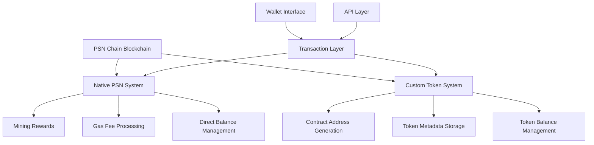

# Design Document - PSN Token System

## Overview

Sistem token PSN Chain dirancang dengan arsitektur dual-token yang memisahkan native coin PSN dan custom token dengan contract address. PSN berfungsi sebagai native currency untuk gas fees dan mining rewards, sementara custom token menggunakan contract address unik untuk identifikasi dan manajemen.

## Architecture

### High-Level Architecture



### System Components

1. **Native PSN Manager**: Mengelola PSN coin tanpa contract address
2. **Token Contract Manager**: Mengelola custom token dengan contract address
3. **Balance Manager**: Unified balance management untuk semua token
4. **Gas Fee Calculator**: Menghitung dan memproses gas fee dalam PSN
5. **Contract Address Generator**: Generate unique contract address untuk custom token

## Components and Interfaces

### 1. Enhanced Blockchain Core

```javascript
class EnhancedBlockchain extends Blockchain {
  constructor() {
    super();
    this.tokenManager = new TokenManager();
    this.gasCalculator = new GasCalculator();
    this.nativeTokenSymbol = 'PSN';
  }
  
  // Enhanced transaction processing with token support
  async createTokenTransaction(transaction) {
    // Validate gas fee in PSN
    // Process token-specific logic
    // Update balances accordingly
  }
}
```

### 2. Token Manager Interface

```javascript
class TokenManager {
  // Native PSN operations (no contract address)
  getPSNBalance(address)
  transferPSN(from, to, amount, gasPrice)
  
  // Custom token operations (with contract address)
  createCustomToken(name, symbol, totalSupply, decimals, creator)
  getTokenByContract(contractAddress)
  transferCustomToken(contractAddress, from, to, amount, gasPrice)
  
  // Unified operations
  getAllBalances(address)
  validateContractAddress(contractAddress)
}
```

### 3. Contract Address Generator

```javascript
class ContractAddressGenerator {
  generateContractAddress(tokenName, symbol, creator, timestamp) {
    // Format: PSN + 40 hex characters
    const data = tokenName + symbol + creator + timestamp + Math.random();
    const hash = crypto.createHash('sha256').update(data).digest('hex');
    return 'PSN' + hash.substring(0, 40);
  }
  
  validateContractAddress(address) {
    return /^PSN[a-fA-F0-9]{40}$/.test(address);
  }
}
```

### 4. Gas Fee Calculator

```javascript
class GasCalculator {
  calculateGasFee(transactionType, dataSize) {
    const baseFee = 0.001; // PSN
    const dataFee = dataSize * 0.0001; // PSN per byte
    return baseFee + dataFee;
  }
  
  validateGasBalance(address, requiredGas) {
    // Check PSN balance for gas payment
  }
}
```

## Data Models

### 1. Enhanced Transaction Model

```javascript
class TokenTransaction extends Transaction {
  constructor(sender, recipient, amount, tokenContract = null, gasPrice = 0.001) {
    super(sender, recipient, amount);
    this.tokenContract = tokenContract; // null for PSN, contract address for custom tokens
    this.gasPrice = gasPrice;
    this.gasFee = this.calculateGasFee();
    this.transactionType = tokenContract ? 'TOKEN_TRANSFER' : 'PSN_TRANSFER';
  }
  
  calculateGasFee() {
    // Calculate based on transaction type and data size
  }
}
```

### 2. Token Metadata Model

```javascript
class TokenMetadata {
  constructor(name, symbol, totalSupply, decimals, creator, contractAddress) {
    this.name = name;
    this.symbol = symbol;
    this.totalSupply = totalSupply;
    this.decimals = decimals;
    this.creator = creator;
    this.contractAddress = contractAddress;
    this.createdAt = Date.now();
    this.isNative = contractAddress === null;
  }
}
```

### 3. Balance Storage Model

```javascript
// Storage structure for balances
{
  "balances": {
    "address1": {
      "PSN": 1000.5,  // Native PSN balance
      "PSNa1b2c3...": 500.0,  // Custom token balance by contract address
      "PSNd4e5f6...": 250.0
    }
  },
  "tokens": {
    "PSNa1b2c3...": {
      "name": "MyToken",
      "symbol": "MTK",
      "totalSupply": 1000000,
      "decimals": 18,
      "creator": "psn123...",
      "contractAddress": "PSNa1b2c3...",
      "createdAt": 1640995200000
    }
  }
}
```

## Error Handling

### 1. Token-Specific Errors

```javascript
class TokenError extends Error {
  constructor(message, code, details = {}) {
    super(message);
    this.name = 'TokenError';
    this.code = code;
    this.details = details;
  }
}

// Error codes
const TOKEN_ERRORS = {
  INVALID_CONTRACT_ADDRESS: 'INVALID_CONTRACT_ADDRESS',
  TOKEN_NOT_FOUND: 'TOKEN_NOT_FOUND',
  INSUFFICIENT_TOKEN_BALANCE: 'INSUFFICIENT_TOKEN_BALANCE',
  INSUFFICIENT_GAS_BALANCE: 'INSUFFICIENT_GAS_BALANCE',
  DUPLICATE_CONTRACT_ADDRESS: 'DUPLICATE_CONTRACT_ADDRESS',
  INVALID_TOKEN_PARAMETERS: 'INVALID_TOKEN_PARAMETERS'
};
```

### 2. Gas Fee Validation

```javascript
class GasValidator {
  validateGasPayment(senderAddress, requiredGas) {
    const psnBalance = this.tokenManager.getPSNBalance(senderAddress);
    if (psnBalance < requiredGas) {
      throw new TokenError(
        `Insufficient PSN for gas fee. Required: ${requiredGas}, Available: ${psnBalance}`,
        TOKEN_ERRORS.INSUFFICIENT_GAS_BALANCE,
        { required: requiredGas, available: psnBalance }
      );
    }
  }
}
```

### 3. Contract Address Validation

```javascript
class ContractValidator {
  validateContractAddress(address) {
    if (!this.isValidFormat(address)) {
      throw new TokenError(
        'Invalid contract address format. Must be PSN followed by 40 hex characters',
        TOKEN_ERRORS.INVALID_CONTRACT_ADDRESS,
        { providedAddress: address }
      );
    }
    
    if (!this.contractExists(address)) {
      throw new TokenError(
        'Token contract not found',
        TOKEN_ERRORS.TOKEN_NOT_FOUND,
        { contractAddress: address }
      );
    }
  }
}
```

## Testing Strategy

### 1. Unit Tests

**Native PSN Tests:**
- PSN balance calculation and updates
- Mining reward distribution
- Gas fee deduction
- Direct PSN transfers

**Custom Token Tests:**
- Contract address generation and uniqueness
- Token creation with metadata validation
- Token transfer with contract address validation
- Balance management for multiple tokens

**Integration Tests:**
- End-to-end token creation flow
- Multi-token transaction processing
- Gas fee calculation and payment
- Wallet balance aggregation

### 2. Test Data Structure

```javascript
// Test scenarios
const testScenarios = {
  nativePSN: {
    mining: 'Test mining reward distribution',
    transfer: 'Test PSN transfer without contract address',
    gasFee: 'Test gas fee calculation and deduction'
  },
  customTokens: {
    creation: 'Test custom token creation with contract address',
    transfer: 'Test custom token transfer with contract validation',
    metadata: 'Test token metadata storage and retrieval'
  },
  integration: {
    multiToken: 'Test wallet with multiple token types',
    gasPayment: 'Test gas payment in PSN for custom token transfers',
    balanceAggregation: 'Test unified balance display'
  }
};
```

### 3. Performance Tests

- Contract address generation speed
- Balance calculation with multiple tokens
- Transaction processing throughput
- Storage efficiency for token metadata

### 4. Security Tests

- Contract address collision prevention
- Private key validation for token operations
- Gas fee manipulation prevention
- Token metadata tampering protection

## Implementation Phases

### Phase 1: Core Token Infrastructure
- Enhanced blockchain core with token support
- Contract address generation system
- Basic token metadata storage

### Phase 2: Native PSN Integration
- PSN-specific transaction processing
- Mining reward system integration
- Gas fee calculation and deduction

### Phase 3: Custom Token System
- Custom token creation API
- Token transfer validation
- Contract address management

### Phase 4: Unified Balance Management
- Multi-token balance aggregation
- Wallet interface integration
- Token discovery and management

### Phase 5: Advanced Features
- Token metadata querying
- Transaction history with token details
- Performance optimization and caching